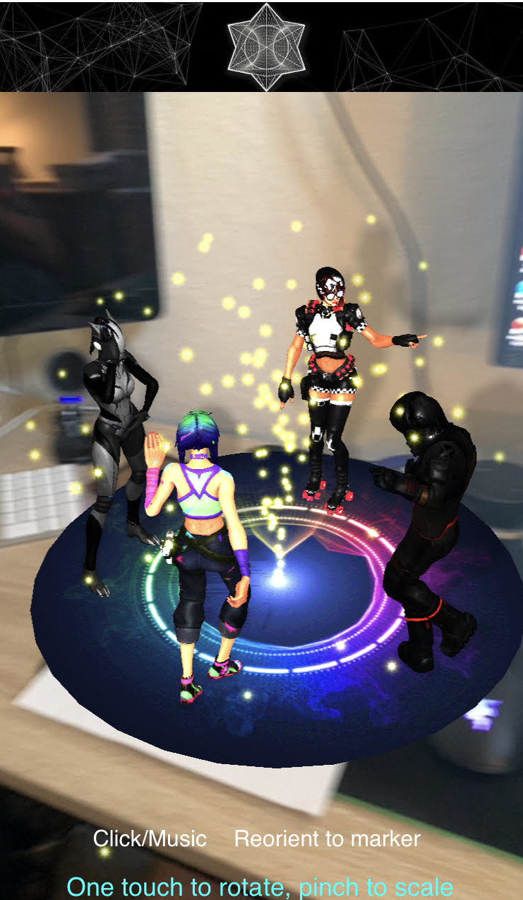

# Innertain AR
Javascript/A-Frame/Three.js oriented project to detect a (hiro) marker and
play an animated scene of **.glb** models to provide a simple Augmented Reality experience to 
coincide with the [Innertain](https://innertain.com/) web site. 

Creative Commons Attributions.
This project incorporates 4 Sketchfab models that feature Fortnite and
other characters dancing. 

[CC4](https://creativecommons.org/licenses/by/4.0/)

- [Fortnite Derby Dynamo](https://sketchfab.com/3d-models/fortnite-derby-dynamo-with-freewheelin-emote-46e94894780842b09d5eb2e73867d053) - by [AstroNatee](https://sketchfab.com/AstroNatee)
- [Fortnite Splaterella](https://sketchfab.com/3d-models/fortnite-splatterella-with-criss-cross-emote-b71030dca31d450f9d1a924050805fce) - by [AstroNatee](https://sketchfab.com/AstroNatee)
- [Lynx Stage 4](https://sketchfab.com/3d-models/lynx-stage-4-true-heart-a754d9c549584f09a99937b94e2ba25d) - by [Coldary](https://sketchfab.com/Coldary)
- [Electroswing](https://sketchfab.com/3d-models/electroswing-b16232a3f1a443248f964492ab1dc151?fbclid=IwAR2Ls0_tG5R010BHps6_i6RH3AkDGKrEE6lex2HD_KO_yqsWKgraOAw4uF8) - by [Coldary](https://sketchfab.com/Coldary)

All models were downloaded and converted to .glb using Blender and associated textures were reduced/optimized for mobile.

Development Notes:

- **SSL/HTTPS** is **required** on the hosting server in order for a mobile device that is downloading
the hmtl/content to allow the Camera to be used.
- **Audio** can only be triggered after a user has interacted (i.e. clicked a button) on the web page.

